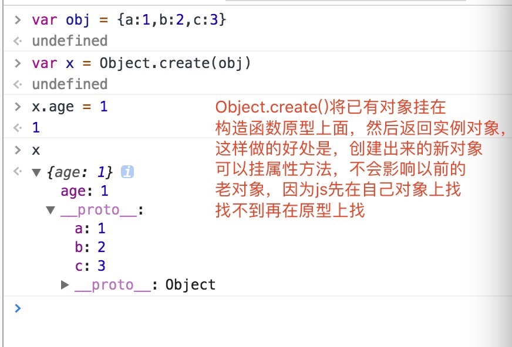

 ### 一些写法
 
 > js另类写法
 
 ```js
 (context ? context.defQueue : globalDefQueue).push([name, deps, callback])
 ```
 >  事件的订阅发布
 
 ```js
 
var on = function (name, cb) {
	    var cbs = this.events[name];
	    if (!cbs) {
	        cbs = this.events[name] = [];
	    }
	    cbs.push(cb);
	},
var emit = function (name, evt) {
    each(this.events[name], function (cb) {
        cb(evt);
    });
    if (name === 'error') {
        //Now that the error handler was triggered, remove
        //the listeners, since this broken Module instance
        //can stay around for a while in the registry.
        delete this.events[name];
    }
}
    
```

> for in

```js
function Func(options){
	var options = options ? options : {};
	var name = options.name;
	this.age = options.age;
	this.sayName = function(){
		console.log(name);
	}
}
Func.prototype.sayAge = function(){
	console.log(this.age)
}
var FuncObj = new Func({name:'jack',age:22});

for(var i in FuncObj){
	FuncObj.hasOwnProperty(i)&&console.log(i);
}
```

> for in 另类写法,不会把原生构造函数的原型属性读出来

```js
var obj = {
	a:1,
	b:2
};
obj.__proto__ = {
	c:3,
	d:4
};
for(var i in obj){
	console.log(i)//a b c d
}
for(var i in obj){
	obj.hasOwnProperty(i) && console.log(i); a b
}
```
> js string replace
```js
str.replace(/./g,function(v,i,x){
	console.log(v,i,x);
	return '='
})

```

> 执行结果


> promise


> Object.create 这也是实现继承的方式,js对象查找方式，就像一个链表，用__proto__连接
这就是原型，当在自身对象上没找到就一层一层的向上原型上查找，
```js
function create(prototype){
	var func = function(){};
	func.prototype = prototype;
	func.constructor = func;
	return new func();
}
var obj = {a:1};
var obj1 = Object.create(obj);
obj1.b = 2;
//实现了对obj的继承，obj在obj1对原型上了
```

> canvas 
```js
function loadImage(url){
	return new Promise((resolve,reject)=>{
		var img = new Image();
		img.src = url;
		img.onload = function(){
			resolve(img);
		}
	});
}
function drawImage({img,x=0,y=0,width=100,height=100}){
	var ctx = document.querySelector('#c1').getContext('2d');
	ctx.drawImage(img,x,y,width,height);
}
async function func(){
	// var url = "http://www.ideatank.cn:3000/langjiu/banner1.jpg";
	var url = "./1.png";
	var img = await loadImage(url);
	var y = 0;
	var timer = setInterval(()=>{
		if(y > 400){
			clearInterval(timer);
		}
		var ctx = document.querySelector('#c1').getContext('2d');
		ctx.clearRect(0,0,500,500)
		y = y + 2;
		var params = {
			x:0,
			y:y,
			img:img,
			width:100,
			height:100
		};
	drawImage(params);
	},16);
	
}
func();
```


