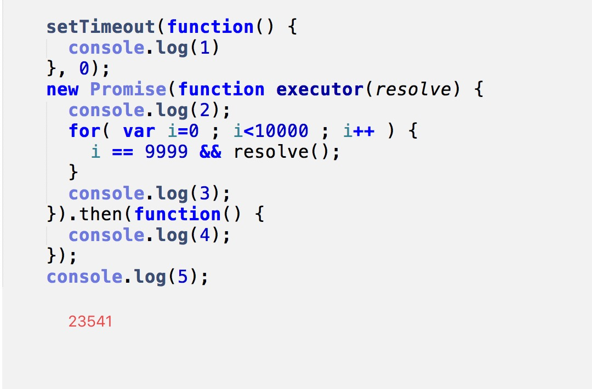

 ### 一些写法
 
 > js另类写法
 
 ```js
 (context ? context.defQueue : globalDefQueue).push([name, deps, callback])
 ```
 >  事件的订阅发布
 
 ```js
 
var on = function (name, cb) {
	    var cbs = this.events[name];
	    if (!cbs) {
	        cbs = this.events[name] = [];
	    }
	    cbs.push(cb);
	},
var emit = function (name, evt) {
    each(this.events[name], function (cb) {
        cb(evt);
    });
    if (name === 'error') {
        //Now that the error handler was triggered, remove
        //the listeners, since this broken Module instance
        //can stay around for a while in the registry.
        delete this.events[name];
    }
}
    
```

> for in

```js
function Func(options){
	var options = options ? options : {};
	var name = options.name;
	this.age = options.age;
	this.sayName = function(){
		console.log(name);
	}
}
Func.prototype.sayAge = function(){
	console.log(this.age)
}
var FuncObj = new Func({name:'jack',age:22});

for(var i in FuncObj){
	FuncObj.hasOwnProperty(i)&&console.log(i);
}
```

> for in 另类写法,不会把原生构造函数的原型属性读出来

```js
var obj = {
	a:1,
	b:2
};
obj.__proto__ = {
	c:3,
	d:4
};
for(var i in obj){
	console.log(i)//a b c d
}
for(var i in obj){
	obj.hasOwnProperty(i) && console.log(i); a b
}
```
> js string replace
```js
str.replace(/./g,function(v,i,x){
	console.log(v,i,x);
	return '='
})

```

> 执行结果


> promise




